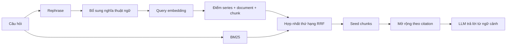

# MuCiRAG

MuCiRAG là mã nguồn cho nghiên cứu hỏi đáp viễn thông trên tài liệu 3GPP. Hệ
thống kết hợp truy xuất ngữ nghĩa ở ba mức **series → document → chunk**, BM25
và mở rộng ngữ cảnh theo các trích dẫn giữa những mục tài liệu.

## Chạy nhanh

Các lệnh bên dưới chạy từ **thư mục gốc repo**, với Python 3.11 và `uv`.

```bash
uv sync --project MuCiRAG --frozen
cp MuCiRAG/.env.example MuCiRAG/.env
```

Điền `OPENAI_API_KEY` và `OPENROUTER_API_KEY` vào `MuCiRAG/.env`.
Cấu hình hiện tại dùng OpenAI cho query embeddings, OpenRouter cho rephrase
và trả lời. Embeddings tài liệu được tải sẵn; query mới vẫn cần gọi provider.

Tải gói tài nguyên đã xử lý từ Hugging Face. Repo private yêu cầu đăng nhập
bằng `hf auth login`. Script dùng commit và checksum được pin trong
`MuCiRAG/resources.lock.json`:

Repo: [QuangHari/MuCiRAG-resources](https://huggingface.co/datasets/QuangHari/MuCiRAG-resources).
Bản runtime v1 gồm 71 file tài nguyên, khoảng 1,87 GB, được pin ở commit
`9ecd1d1c552dd695d33b799e54a451c9657fbf2a`.

```bash
uv run --project MuCiRAG python mucirag.py assets download
```

Gói có chunks, embeddings/metadata, lexical index, hierarchical anchors,
router/vocabulary và đúng bộ 1.840 câu. Không cần tải tài liệu Markdown/DOCX gốc
để chạy pipeline. Nếu máy đã có đủ artifacts, bỏ qua bước tải.

```bash
# Kiểm tra vectors, metadata, chunk IDs và hierarchical anchors, không gọi API.
uv run --project MuCiRAG python mucirag.py assets validate

# Hỏi một câu; lệnh này gọi embedding/LLM provider.
uv run --project MuCiRAG python mucirag.py ask "What is network slicing?"

# Chạy thử một câu TeleQnA vào file kết quả riêng.
uv run --project MuCiRAG python mucirag.py benchmark \
  --limit 1 --workers 1 --output results/teleqna/mucirag-smoke.jsonl
```

Thêm `--help` sau `ask`, `benchmark`, `summarize` hoặc `assets` để xem tùy chọn.
`ask --no-answer` vẫn gọi rephrase và query embedding, chỉ bỏ bước trả lời.

## MuCiRAG hoạt động như thế nào?



Query embedding dùng câu đã rephrase và bổ sung thuật ngữ. BM25 ở bước seed
nhận câu hỏi gốc. Sau đó `rrf_bfs` chỉ xếp hạng những đích citation ở từng độ
sâu, dùng câu đã bổ sung thuật ngữ cho cả dense và BM25. Các lựa chọn đáp án
TeleQnA chỉ được đưa vào prompt trả lời, không vào truy xuất.

Cấu hình hiện tại trong [`MuCiRAG/config.toml`](MuCiRAG/config.toml):

| Thành phần | Giá trị |
| --- | --- |
| Embedding | OpenAI `text-embedding-3-large`, 1.024 chiều |
| Rephrase / answer | OpenRouter `mistralai/mistral-large-2512` |
| Hierarchical weights | series 0,1; document 0,1; chunk 0,8 |
| Hybrid RRF weights | dense 0,3; BM25 0,7; RRF k = 60 |
| Seed chunks | 8 |
| Citation | `rrf_bfs`, sâu 1, tối đa 4 chunks mỗi độ sâu |
| Vocabulary | `release18_unambiguous` |

Đây là cấu hình đang có trong repo, không phải tuyên bố cấu hình tối ưu hoặc
kết quả chính thức của paper. Các nhánh `router`, `semantic_bfs`, `gain` và
`paper_legacy` được giữ để chạy đối chứng. Chỉ nhánh `gain` tạo facets bằng LLM.

## Đọc code

```text
mucirag.py                 Điểm chạy chung: ask / benchmark / summarize / assets
docs/                      Kiến trúc, tài nguyên và hướng dẫn phát hành
MuCiRAG/               Implementation MuCiRAG
  config.toml              Cấu hình thí nghiệm
  pyproject.toml, uv.lock   Dependency Python 3.11
  src/
    settings.py            Đọc cấu hình và đường dẫn
    rag/service.py         MuCiRAGService: điều phối pipeline
    rag/corpus.py          EmbeddingCorpus: truy xuất và ánh xạ chunk
    rag/ranking.py         Hợp nhất thứ hạng RRF
    rag/citation_expansion.py  Mở rộng theo citation
    rag/anchor_hierarchy.py   Chuẩn bị và kiểm tra hierarchical anchors
    rag/clients.py         Prompt và lời gọi LLM
    rag/vocabulary.py      Bổ sung thuật ngữ
    embeddings/            Adapter embedding provider
    corpus/                Đọc nguồn tài liệu
    evaluation/            Chấm điểm và MLflow
  scripts/                 Chuẩn bị corpus, tài nguyên và chạy benchmark
  analysis/                Tổng hợp, so sánh kết quả và biểu đồ Venn
  tools/                   Tiện ích vận hành MLflow
  tests/                   Kiểm thử offline
  resources/               Tải từ Hugging Face, không đưa vào Git
  results/                 Kết quả cục bộ, không đưa vào Git
dataset/                   Corpus và embeddings tải sẵn, không đưa vào Git
```

Implementation nằm trong `MuCiRAG/`. Các lệnh cũ dùng `newbaseline/` cần đổi
sang `MuCiRAG/`. Thư mục implementation cũ `Telco-RAG_api/` đã được gỡ khỏi
workspace; các kết quả thí nghiệm local được giữ nguyên.

Hướng dẫn các script phân tích nằm trong [`analysis/README.md`](MuCiRAG/analysis/README.md).

Nên đọc [`service.py`](MuCiRAG/src/rag/service.py) trước, sau đó
[`docs/architecture.md`](docs/architecture.md) và module tương ứng.

## Đánh giá và tái lập

```bash
uv run --project MuCiRAG python mucirag.py benchmark \
  --workers 1 --progress-every 10 --output results/teleqna/mucirag-full.jsonl

uv run --project MuCiRAG python mucirag.py summarize \
  --run results/teleqna/mucirag-full.jsonl

uv run --project MuCiRAG python -m pytest MuCiRAG/tests -q
```

Bộ test được giữ local và ignore khỏi Git theo chính sách repository; lệnh pytest
ở trên chỉ dùng khi máy đã có thư mục `MuCiRAG/tests/`.

Đường dẫn `--output` và `--run` tương đối được tính từ `MuCiRAG/`, kể cả
khi dùng CLI ở gốc repo. Chạy lại cùng lệnh benchmark để tiếp tục checkpoint;
đổi file kết quả khi đổi model, prompt, retrieval hoặc dataset. `--overwrite`
sẽ bỏ checkpoint đích. Mỗi worker tạo một service riêng, nên tăng workers cũng
làm tăng RAM sử dụng.

Gói dữ liệu hiện có 252.329 vectors thuộc 15 nhóm và snapshot TeleQnA mở rộng
1.840 câu. Phải phân biệt snapshot này với tập lọc gốc 1.810 câu khi báo cáo.
Manifest thí nghiệm lưu cấu hình và SHA-256 của dataset; lịch sử kết quả cũ
không được đóng gói cùng tài nguyên. MLflow mặc định ghi cục bộ.

## Tài nguyên và Docker

Xem [`docs/resources.md`](docs/resources.md) để đóng gói/upload lên Hugging Face,
kiểm tra checksum hoặc xây dựng lại artifacts. Không cần embed lại tài liệu
khi dùng gói đã chuẩn bị.

Docker đóng gói code cùng dữ liệu đã tải ở máy build:

```bash
docker build -t mucirag:local .
docker run --rm --env-file MuCiRAG/.env \
  -v mucirag-results:/workspace/MuCiRAG/results \
  mucirag:local mucirag.py benchmark --limit 1 \
  --output results/teleqna/docker-smoke.jsonl
```

## Nguồn và giấy phép

MuCiRAG sử dụng corpus từ [GSMA/3GPP](https://huggingface.co/datasets/GSMA/3GPP),
đánh giá dựa trên [TeleQnA](https://huggingface.co/datasets/netop/TeleQnA), và kế
thừa tài nguyên router/vocabulary cùng lựa chọn tài liệu của Telco-RAG.
Chi tiết revision và nguồn có trong [dataset card](docs/huggingface-dataset-card.md).
Giấy phép mã nguồn hiện có ở [`license`](license); các tài nguyên bên thứ ba
vẫn theo điều khoản của nguồn tương ứng.

Tên paper là **MuCiRAG**. Thông tin tác giả, tên đầy đủ, venue và DOI cần được
bổ sung theo bản thảo chính thức trước khi tạo trích dẫn BibTeX.
